# 一、需求分析

## 1.信息需求

社团具有四个小组：java组、python组、.net组、前端组。每个小组有多名组长负责教学，有会长负责社团大小事务。社团管理系统涉及的实体有：会长、组长、组员、专业、学院。一个社团有一个会长多个副会长；一个组有多名组长，一个组长只能担任一个组的组长；一个组有多名组员，而一个组员只能参加一个小组。

## 2.功能需求

社团管理系统的用户分别为：组员、组长、会长。组员可以查看和编辑个人信息、查看社团信息、修改密码、进行签到；组长可以查看和编辑个人信息，查看组员信息并编辑、发布签到、登记组员成绩、修改密码、删除组员、具有搜索社团成员权限；会长可以查看和编辑个人信息以及社团所有成员的信息、任免组长、删除、查看各组信息、搜索社团成员。

# 二、概念设计

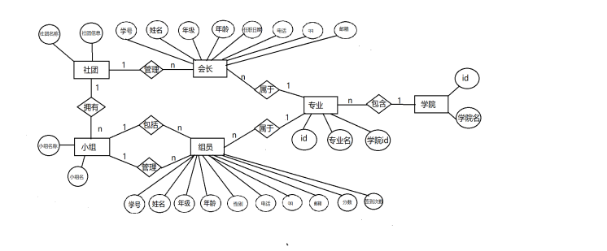

# 三、程序设计

三个角色会长、组长、组员，拥有不同的功能和权限，需要设置三种页面。

会长页面，会长具有任免组长，查看并修改社团成员、修改社团信息、修改密码。会长页面如下

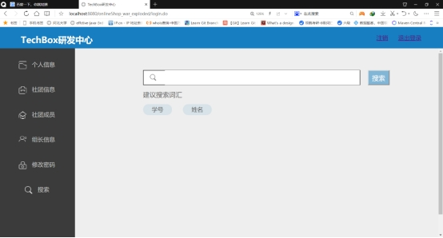 

 

组长页面，组长可以查看组员信息，修改组员的考核成绩，发布签到，查看并修改个人信息，修改密码。

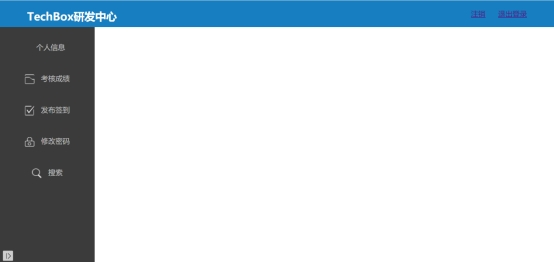 

组员页面，组员可以查看并修改个人信息、进行签到，修改密码。

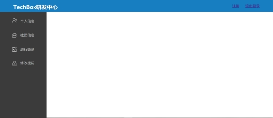

会长信息

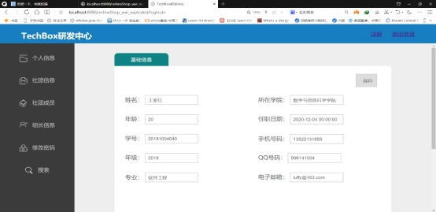 

会长查看小组成员

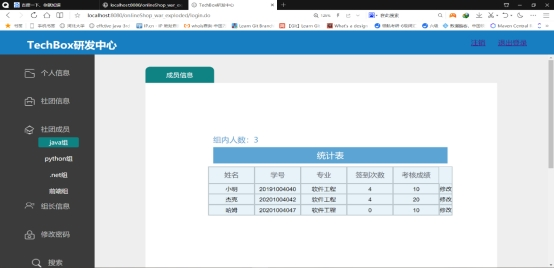 

会长添加组长

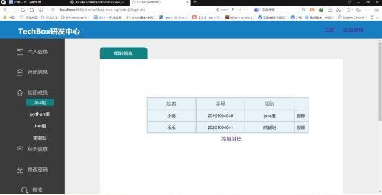 

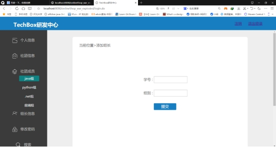 

搜索成员

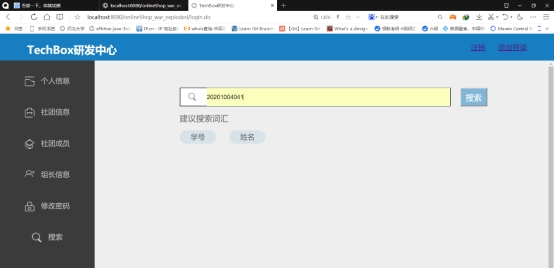 

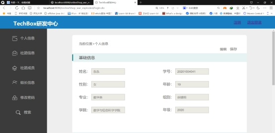 

组长修改组员成绩

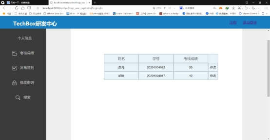 

组长发布签到

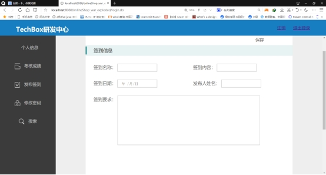 

组员查看个人信息

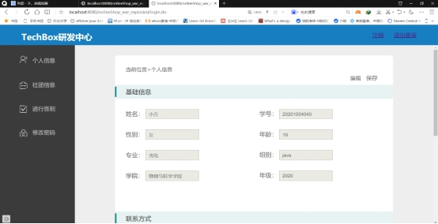 

组员进行签到

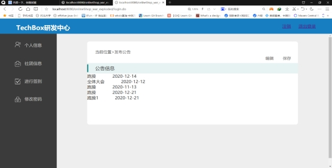 

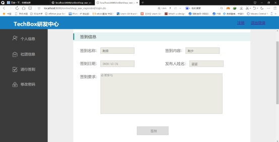 

修改密码

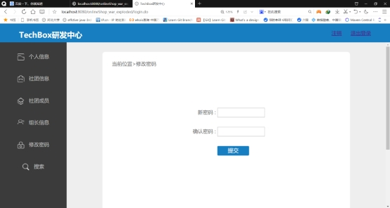